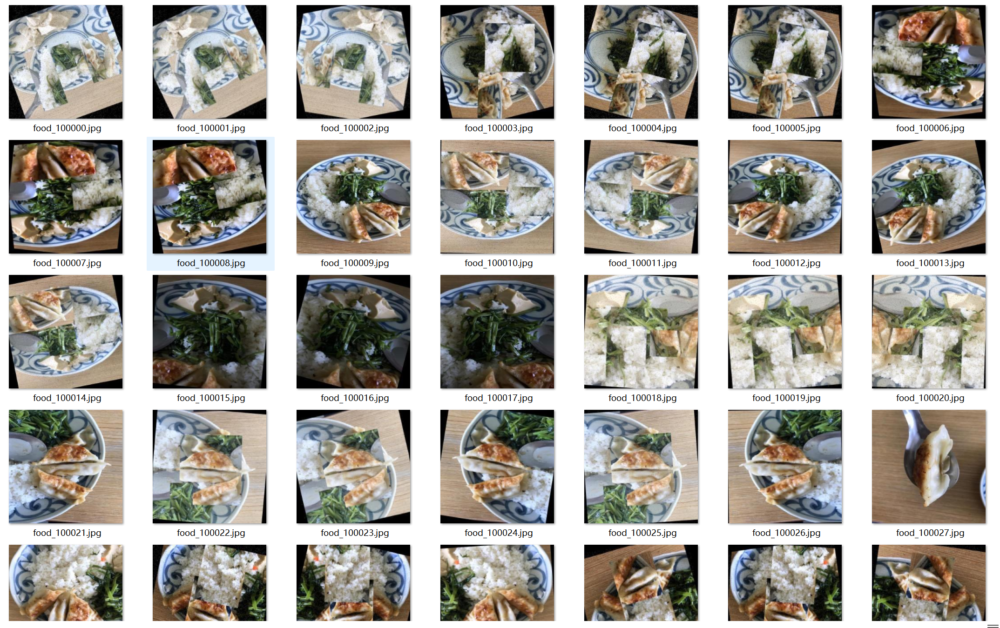
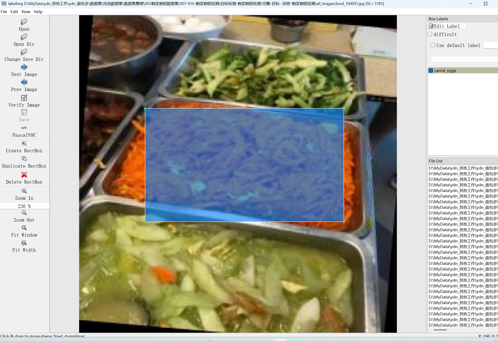
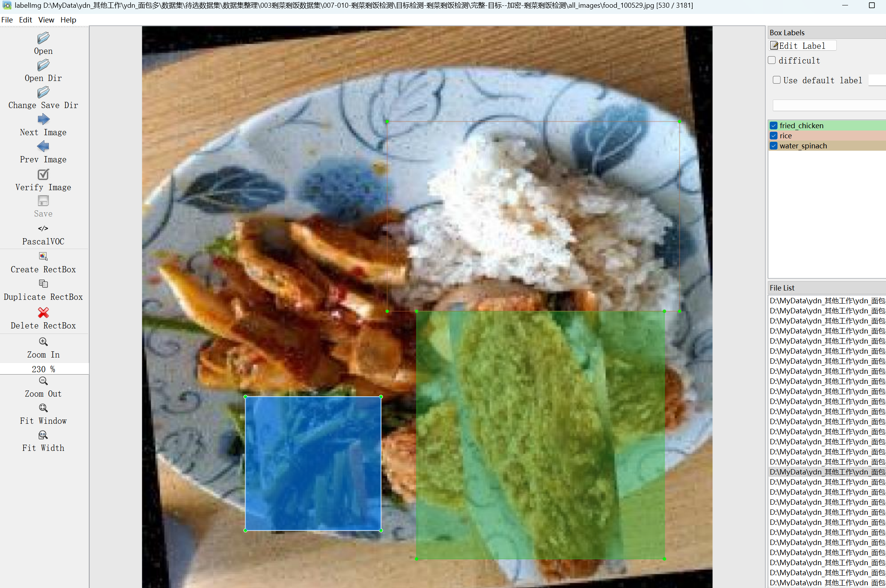
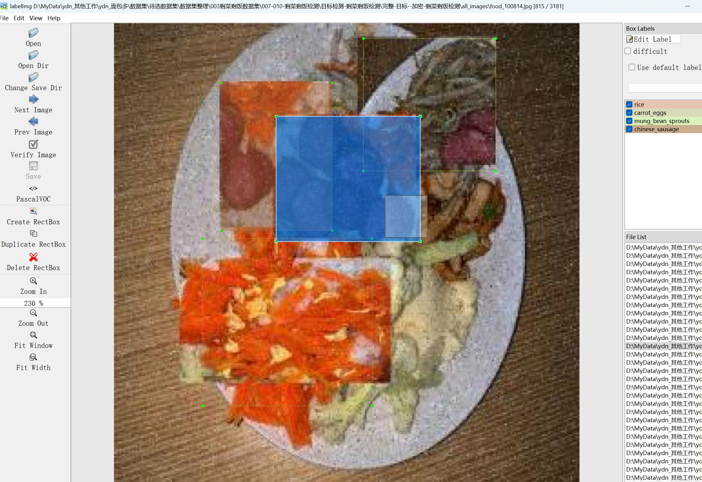

# Remaining Food Detection-Target Detection Dataset

Dataset Information Introduction: A total of 3181 images and corresponding annotation files are included. The annotation files come in two formats: VOC formatted xml files and YOLO formatted txt files.

The annotated objects include the following:
['beijingbeef', 'carroteggs', 'chicken_nuggets', 'chinese_cabbage', 'chinese_sausage', 'curry', 'fried_chicken', 'fried_dumplings', 'fried_eggs', 'fried_rice', 'honey_walnut_shrimp', 'kung_pao_chicken', 'mung_bean_sprouts', 'original_orange_chicken', 'rice', 'string_bean_chicken_breast', 'triangle_hash_brown', 'water_spinach', 'white_steamed_rice']

The number of annotation boxes is as follows: (Annotations are usually marked in English, with Chinese provided in parentheses for reference)
Note: In one image, multiple objects may be annotated, so the total number of annotation boxes may exceed the total number of images

The complete dataset consists of three folders and one txt file:
all_images folder: stores images from the dataset, screenshots attached here:
Image resolution size:
all_txt folder and classes.txt: store yolo formatted txt annotation files, in the same quantity as the images, each annotation file corresponds to an individual image.
For a detailed understanding of the standard format of the yolo format, please search for it on your own. In brief, number 0 indicates the name of the object at array index 0 in the classes.txt file.
all_xml folder: VOC formatted xml annotation files.
In the same quantity as the images, each annotation file corresponds to an individual image.
For a detailed understanding of the standard format of the VOC format, please search for it on your own.
Both formats of annotations are usable, choose one according to your preference.
Annotation screenshots:
## Images

Here is a pay link on Stripe ( https://buy.stripe.com/3cs8yP7sY87d0vu9AB ). Please contact me lonlonago@foxmail.com after funding $89, and I will send you a complete data files , thank you!

